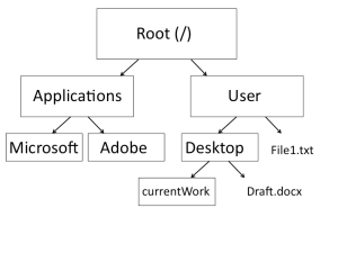

# Unix tutorial – how to use the Terminal
Hannes Svardal

Acknowledgments:
This material is based on the Unix primer by Angelica Cuevas, Angela P. Fuentes-Pardo, Julia M.I. Barth
for the Population and Speciation Genomics Course in Cesky Krumlov 2022

<!-- 
##### Table of Contents  
[Headers](#headers)  
[Emphasis](#emphasis)  
-->

## Introductory slides

Some introductory slides can be found here: [add link]

## Learning goals

- Navigate in a UNIX terminal environment
- Create, move, and delete directories
- Create, move, delete and edit files
- Use basic UNIX commands and know where to find help

## How to use this tutorial

- Open a unix terminal
  - On Windows
    - install Ubuntu on the Windows subsystem for Linux (WSL)
      - [Press here for help](HowToInstallWSL.md)
    - Press `Windows Key`, type *Ubuntu* and press `Enter`
  - On Linux:
    - Open a Terminal
  - MacOS:
    - Open the app *Terminal* or install and open the app *iTerm*
    - Make sure that your shell is set to *bash*
- Questions or tasks are indicated with **Q**
- Text `with gray background` usually indicates a command that you can type or copy to the terminal


  <details>
    <summary>If you get stuck, check the answer-box.</summary>

  On no, only if you get stuck!! First try to find the answer yourself!

  </details>


## Why would we use the Terminal / shell in the first place?

*Scripting:* We can write down a sequence of commands to perform particular tasks or analyses;
when working with genomic data, a task usually takes minutes, sometimes hours or even days – it’s no fun to sit and wait in front of your computer this long just for a mouse-click to initiate the next task.

*Powerful Tools:* In UNIX, powerful tools are available that enable you to work through large amounts of files, data, and tasks quite quickly and in an automated (that is, programmatic) way.

*Easy remote access:* In most cases, it is not possible anymore to deal with genomic data on a desktop computer. You will usually run analyses on clusters at high performance computing facilities at your university, or – like in this course – on the Amazon cluster.

*GUI (Graphical User Interface) is not available* for many bioinformatics programs: Genomics is a fast evolving field and developing a GUI takes time and effort.

*Compatibility:* The terminal can (remotely) be accessed with computers running on different operating systems

## Basic syntax of shell commands

UNIX or shell commands have a basic structure of:
```
command -options target
```
The command comes first (such as `cd` or `ls` as we will see later) then any options
(always proceeded by a `–` or a `--` and sometimes followed by a value) 
and then the target (such as the file to move or the 
directory to list). 
These commands are written on the prompt (terminal command line).

The `-options` are sometimes called flags. 

The `targets` are sometimes called positional arguments.

Example:


    cp -r folder1 folder2

- Here `cp` is a bash command that copies files or folders.
- `-r` is an option that tells the program to copy recursively, meaning to include all files in the folder and in all subfolders.
- `folder1` and `folder2` are two targets. 
  - `folder1` is the file path from which `cp` copies files.
  - `folder2` is the file path to which `cp` copies files.

### Find your keys!

There are some keys that are used a lot in UNIX commands but can be difficult to find on some keyboards.

**Q** Open a text editor and type the following keys:

`~` tilde

`/` forward slash

`\` back slash or escape

`|` vertical bar or pipe

`#` hash or number or gate sign

`$` dollar sign

`*` asterisk

`’` single quote

`"` double quote

`  backtick

`ctrl c` The panic button: If you are running a process or 
program and it is stuck or doing something you don’t want it to
do: then hold the control key and press c. 
This will kill the current process and return you to your prompt.
If this does not work, close the terminal and open it again.

### Getting help

A UNIX cheat sheet like [this one here](https://files.fosswire.com/2007/08/fwunixref.pdf) might be helpful 
as a reference of some of the most common UNIX commands. <br>

Also, never forget that the internet is your best friend! Google your questions or use an AI chatbot. <br>

Most UNIX commands and many other programs have help pages accessed through: `command_name --help`, or `command_name -h`,
which describe in short notation different ways to run the program.
Some programs that need arguments a
Most programs also have a more exhaustive manual page accessed by typing `man PROGRAM_NAME`.

  Note that to exit man pages or many 
  other programs opening text in the terminal,
  you need to press `q`. 

**Q** Access the `ls` help page and the `ls` manual page.

  <details>
    <summary>Show me how to do this.</summary>
    

Type `ls --help` to access the “list” help page.
Type `man ls` to access the “list” manual page.

Note that if you type `ls -h` you don’t get the help page for ls. That’s because -h is the option that print sizes of files in a human-readable format (like 1K, 234M, 2G etc) when combined with the -l option, like in ls -lh. Find the -h option when you access the ls help page with ls --help
    
    
  </details>


**Q** What do the `cp`, `grep`, and `nano` commands do?

  <details>
    <summary>Show me how to get to the answer.</summary>
  Type, for example

  ```
  cp --help
  man cp
  ```
  The first one gives something like
  
  ```
  usage: cp [-R [-H | -L | -P]] [-fi | -n] [-aclpsvXx] source_file target_file
       cp [-R [-H | -L | -P]] [-fi | -n] [-aclpsvXx] source_file ... target_directory
  ```  
  Here, possible options are given with `-` and targets are described afterwards.
  Flags or targets that are placed in brackets `[]` are optional 
  (you can use them but you do not need to). 
  The pipe `|` symbol is an exlusive or, so it means that either one or
  the other option can be used.

  The above usage text still has limited information. We see all the
  flags but we do not know what they do. To get more information, 
  check `man cp` or google for example `cp unix usage` or 
  `cp unix examples` or `cp unix manual`. 

  </details>

### Navigation I

A computer file system is laid out as a hierarchical multifurcating tree structure. This may sound confusing but it is easy to think of it as boxes of boxes where each box is a directory.
There is one big box called the root. All other boxes are contained in this one big box. Boxes have labels such as ‘Users’ or ‘Applications’. Each box may contain more boxes (like Desktop or Downloads or Work) or files (like ‘file1.txt’ or ‘draft.docx’)
Thus it is hierarchical (boxes in boxes),
multifurcating
(each box can contain multiple boxes or files) 
tree structure (similar to how a tree has branches and leaves).



There are two ways to refer to directories and their positions in this hierarchy and relationship to other directories: absolute and relative paths.

A) **Absolute path**
The absolute path is the list of all directories starting from the root 
that lead to the current directory. Directories are separated using a `/`.

For example, the path to the directory ‘Desktop’ in the picture above is `/User/Desktop`

**Q** What is the absolute path to the directory `currentWork` above?

  <details>
    <summary>Show me the answer.</summary>
  
    /User/Desktop/currentWork

  </details>

B) **Relative path**

A directory can also be referred to by its relative location from some other directory 
(usually where you are working from). 
The parent directory of a directory is referred to using `..`
The current directory is referred to using `.`
For example, if I am in ‘Desktop’ and want to get to ‘User’ the relative path is `..`.
If I am in `User` and want to get to `Applications`, the relative path is 
`../Applications` (going one directory up, and then down into `Applications`).

**Q** What is the relative path to get from `Adobe` to `Microsoft`?

  <details>
    <summary>Show me the answer.</summary>
  
    ../Microsoft

  </details>

**Q** What is the relative path to get from `currentWork` to `Adobe`?

  <details>
    <summary>Show me the answer.</summary>
  
    ../../../Applications/Adobe

  </details>

### Download the tutorial data

If you have not done so yet,
**download the tutorial data in your terminal:**

- To return to your home folder, type


    cd ~

Note: Actually the tilde is not needed, because per default `cd` 
without argument goes to your home folder.

- Download the test data.

  ```
    wget  https://raw.githubusercontent.com/feilchenfeldt/Evolutionary_Genomics_Tutorial/main/Data.zip
  ```
  
  <details>
    <summary>Note for MacOS users.</summary>
  
  wget is not available on MacOS, use `curl` instead.

  </details>


- Then press `Enter`. A `.zip` archive (=compressed file) with test data should be downloaded.
  - Decompress the `.zip` archive

  
    unzip Data.zip


### Where am I?
Sometimes one can get confused in which folder the terminal currently is. 
The command `pwd` is very useful for this. It returns the current work directory.
- Type


    pwd

Confirm that you are in your home folder. If not, go there.

### Navigation II

Use the commands `ls` and `cd` to navigate the file system. 
Remember, `ls` shows you all files and folders in the current
directory and `cd <dirname>` changes to dirname. 

Note on syntax: When I write `<name>`, the `<>` just means that you
should replace the content by any appropriate name. You should
**not** actually type the symbols `<` and `>`.

**Q** Navigate to the folder `UnixBasics` which is located in 
the folder `Data` that you generated in your homefolder
by unzipping `Data.zip`.

  <details>
    <summary>Show me how to do this.</summary>
  
Assuming that you are in your home directory

      cd Data/UnixBasics

If you are not in your home directory, 
first go there by typing `cd`. If you still get an error, 
use `ls` to check whether the folder `Data` exists.

  </details>

**Q** Check whether you really are in the directory `UnixBasics`

  <details>
    <summary>Show me how to do this.</summary>

Type `pwd` to display the absolute path of the current directory.
    It should give something like `/home/<username>/Data/UnixBasics`

  </details>

**Q** List all files and folders in the current directory.

  <details>
    <summary>Show me how to do this.</summary>

      ls

  </details>

**Q** Check the size of all files in the current 

  <details>
    <summary>Show me how to do this.</summary>

`ls -l` The flag `-l` specifies a ‘long listing format’. 
It returns the columns: permissions, number of hardlinks, 
file owner, file group, file size in bytes, modification date, filename.

  However, you will see that the file size is not in a very useful format.
It is in number of bytes. Therefore, use `ls -lh`, which will print 
file-size in human-readable format e.g., kB or MB.
  </details>


**Q** Go back to your home directory.

  <details>
    <summary>Show me how to do this.</summary>
  
  Using the absolute path:
  
    cd /home/<your_username>
  (replace <your_username> by your username) 

  Using the relative path:
    
    cd ../../

  Using a really useful shortcut:
  
    cd

  </details>

**Q** Go to the folder `UnixBasics` in two steps,
by first going into the folder `Data` and then into 
the folder `UnixBasics`.

  <details>
    <summary>Show me how to do this.</summary>

    cd Data
then

    cd UnixBasics


  </details>

### Managing your directories and files


A new folder can be created using the command `mkdir` 
(meaning “make directory”).

**Q** In the folder *UnixBasics*, create a new directory called
*my_unix_files*.

  <details>
    <summary>Show me the answer!</summary>

  First make sure that you are in the directory *UnixBasics*.
  E.g., by running `pwd`. If not, navigate there. Then run

    mkdir my_unix_files

  </details>


**Q** Create an empty text file called *file1.txt* using `touch`.

  <details>
    <summary>Show me the answer!</summary>

    touch file1.txt
  Tip: `touch` can also be used to update the access date of a file or directory.

  </details>


Editing files in the terminal is a bit tedious but you’ll learn quickly!
Here we will use the text editor called **nano**.

**Q**  Edit *file1.txt* using nano and write 
‘Hello fellow participants’ in the second line.

  <details>
    <summary>Show me the answer!</summary>

    nano file1.txt

  ENTER to access the second line \
  Type: ‘Hello fellow participants’ \
  ctrl o to save, ^ corresponds to ctrl in case you were wondering 🙂 \
  ENTER to validate saving\
  ctrl x to exit

  </details>

**Q** Copy *file1.txt* to the *my_unix_files* directory,
name this copy file2.txt

  <details>
    <summary>Show me the answer!</summary>

    cp file1.txt my_unix_files/file2.txt

  cp stands for ‘copy’

  </details>


**Q** Rename *file1.txt* to *myfile1.txt*

  <details>
    <summary>Show me the answer!</summary>

    mv file1.txt myfile1.txt

  The command `mv` stands for ‘move’.
  It is the same command to move or to rename a file 
  (‘move’ a file in the current directory with a different output name).

  </details>


**Q** Move *myfile1.txt* to the *my_unix_files* folder.

  <details>
    <summary>Show me the answer!</summary>

    mv myfile1.txt my_unix_files/

  The command `mv` stands for ‘move’.
  It is the same command to move or to rename a file 
  (‘move’ a file in the current directory with a different output name).

  </details>

**Q** Go to ‘my_unix_files’ directory and delete the file *file2.txt*. 
The command to remove files is `rm`.

  <details>
    <summary>Show me the answer!</summary>

    cd my_unix_files
    rm file2.txt

  rm stands for ‘remove’

  </details>


**Q** Go one directory up and delete the *my_unix_files* folder.

  <details>
    <summary>Show me the answer!</summary>

    cd ..
    rm unix_tutorial

  This returns an error, only using rm is not possible to remove a directory, a flag that allows deleting a directory and its content is needed.
  
    rm -ri unix_tutorial
  
  The `-r` flag remove directories and their contents recursively and 
  `-i` tells the command to ask for permission to delete.
  To delete an empty directory, you can also use `rmdir`.

  </details>


There is no ‘undo’ or ‘trash folder’ in the terminal, so be very careful when deleting files or directories!
It is a good practice to use the -i flag as a safety step with the
rm (e.g.,:`rm -i file1.txt`)

### View and manipulate files

For the next exercise, you are going work with the text file `Test_file_genomics_data.txt`, 
which is located in the directory `UnixBasics`.

- If you are not already in the directory `UnixBasics`, then navigate there.

There are several ways to view the content of a file:

- `cat` will print the whole file. It can be useful for viewing small
files and as a part of computational processing using the pipe `|` 
(which you will learn later), but it is not suitable for viewing large files.
Remember, you can always use ctrl c to kill the task.

- `less` prints the content of a file on one screen length at a time. 
An important difference between `less` and `cat`, is that `less`blocks
your terminal. You do not return to the commandline until you exit the 
program. It is a bit similar to starting a program on Windows 
(or any graphical desktop environment).

Within `less`:\
`ENTER` displays the next line\
`k` displays the previous line\
`SPACE` displays the next page\
`b` displays the previous page\
`shift g` prints the end of the file\
`q` to exit

> [!TIP]
>If a file contains very long lines,
these lines will wrap to fit the screen width. (Meaning, they
will be broken at the current width of the terminal window.)
This can result in a confusing display, especially if there are,
for example, long sequences in your file. 

To chop the lines and only display the beginning of each line we can use:

    less -S <filename>

You can scroll horizontally across lines using the arrow keys.

**Q** Explore the example file using less and cat.

  <details>
    <summary>Show me how to do this!</summary>

    cat Test_file_genomics_data.txt
    
    less Test_file_genomics_data.txt


  </details>


This file contains population pairwise genome-wide statistics 
(*Fst*, *Dxy*, nucleotide diversity (pi) per population) 
calculated on 10 kilobase (kb) windows.
‘scaffold’ specifies the linkage group or chromosome
‘Start’ & ‘End’ specify the start and end position of the window
‘FST’ & ‘DXY’ represent relative and absolute genomic differentiation measures
‘Set1_pi’ & ‘Set2_pi’ correspond to the nucleotide diversity for population 1 and population 2, respectively

`head` will print the first 10 lines of a file on the prompt.

`tail` will print the last 10 lines of a file on the prompt.

**Q** Print the first 25 lines of the example file `Test_file_genomics_data.txt`


  <details>
    <summary>Show me how to do this!</summary>

    head -n 25 Test_file_genomics_data.txt

  </details>

Show me the answer!

**Q** Print the last 50 lines of the example file `Test_file_genomics_data.txt`

  <details>
    <summary>Show me how to do this!</summary>

    tail -n 50 Test_file_genomics_data.txt

  </details>

`grep` is a tool for searching files for a specific content. It has many powerful applications, the basics of which will be explained here.

The basic syntax of grep is

    grep 'search pattern' <filename>

**Q** Print all the lines that contain LG13 from the file `Test_file_genomics_data.txt`

  <details>
    <summary>Show me how to do this!</summary>

    grep 'LG13' Test_file_genomics_data.txt

  </details>

**Q** How many lines contain LG20 in the file Test_file_genomics_data.txt?

  <details>
    <summary>Show me the answer!</summary>

    grep -c 'LG20' Test_file_genomics_data.txt

>[!Tip] Use `grep --help` to obtain information about the flag `-c`. It stands for “count”.
  </details>


**Q** Print three lines that come before and three lines after 
the pattern ‘scaffold’ in the file `Test_file_genomics_data.txt`

  <details>
    <summary>Show me how to do this!</summary>

    grep -B 3 'scaffold' Test_file_genomics_data.txt
    grep -A 3 'scaffold' Test_file_genomics_data.txt

  >[!Tip] You can also use the `-C` flag to print the lines before and after simultaneously.
  </details>


**Q** Print all the lines that do not contain **LG** in the file 
`Test_file_genomics_data.txt`

Show me the answer!
grep -v 'LG' Test_file_genomics_data.txt
Use grep --help to obtain information about the flag -v. It stands for “invert-match”.
cut allows you to extract a specific column from a file. By default, the column delimiter is TAB. You can change this using -d

Q Print the column 5 of the test file

Show me the answer!
cut -f 5 Test_file_genomics_data.txt
wc counts the number of lines, characters or words in a file

Q How many lines has the test file?

Show me the answer!
wc -l Test_file_genomics_data.txt
sort will sort lines of a text file

Q Sort the test file by increasing Fst value

Show me the answer!
sort -g -k 4 Test_file_genomics_data.txt
-g applies for a general numeric sort
-k specifies the column in which the values should be sorted
sed has many powerful applications including the replacement of one block of text with another.
The syntax for this is:

sed 's/'pattern to find'/'text to replace it with'/g' 'filename'

This will output the changed file contents to the screen.

If we want to redirect the output to a new file we can use > , for example:

sed 's/'pattern to find'/'text to replace it with'/g' 'filename' > 'new_filename.txt'

Q Change the text ‘LG’ to ‘LinkageGroup’ on every line of the test file and redirect the output to a new file called Test_file_genomics_data_renamed.txt. Then visually inspect the file to check if it worked.

Show me the answer!
sed 's/LG/LinkageGroup/g' Test_file_genomics_data.txt > Test_file_genomics_data_renamed.txt
head Test_file_genomics_data_renamed.txt
tail Test_file_genomics_data_renamed.txt
The pipe | is a very useful key that sends the output from one unix command as input into another command, for example:

grep 'LG12' Test_file_genomics_data.txt | head

Q Create a new file containing the last five lines of the column two of the example file Test_file_genomics_data.txt using a single command line.

Show me the answer!
cut -f 2 Test_file_genomics_data.txt | tail -n 5 > New_file.txt
It is often useful to copy a file from a remote system (e.g., the amazon server) to a local system (e.g., your computer), and vice-versa.
To do this, a useful command is scp, that stands for ‘Secure Copy Protocol’. It works like cp in the sense that both commands require a source and a destination location for the copy operation; the difference is that with scp, one or both of the locations are on a remote system and requires authentication.
This example would copy a file from your personal computer to the amazon server:

scp 'source_path/FILE_NAME.txt' 'wpsg@ec2-XX-XXX-XXX-XXX.compute-1.amazonaws.com:/destination_path/'


## Conda

In bioinformatics you will often need computer programs that are 
not part of your Unix default installation. There are several ways
of installing such programs. For some of them you need administrator
rights on your system.

Here we will only explain one way of installing programs packages, 
using the **conda** package manager.

The conda package manager has several advantages:
 - It works with large program respositories where you can find 
virtually all packages for *python*, many for R., and many unix programs 
especially bioinformatics programs.
 - Conda is cross-platform, so you can get similar software installations
on different operating systems.
 - You do not need any administrator rights to install packages with conda.
 - Unix (and python/R) tools usually depend on many other tools and programs. 
Conda makes sure that you have the right versions of all dependencies installed.
 - You can create separate conda environments with different versions 
of different packages.
 - You can export information on your conda environment so that
other people can redo the same analysis with the same software 
versions (Same "compute environment").

One disadvantage of conda is that it can be slow to resolve dependencies and 
install programs. This can be solved by creating new environments, 
by carefully choosing channels (places for where programs will be installed) and 
by using `mamba` instead of conda. (Not shown here)

### Installing conda

- Download conda

```
wget https://repo.anaconda.com/miniconda/Miniconda3-py38_23.11.0-2-Linux-x86_64.sh
```

(Note: For this tutorial we are using conda with python 3.8, 
but you might choose more up-to-date versions for your other projects.)

- Install miniconda

```
bash Miniconda3-py38_23.11.0-2-Linux-x86_64.sh -b
```

Once miniconda is installed, you need to initialise conda by running

    ~/miniconda3/bin/conda init


Now, every time you open a new terminal window, 
you should see `(base)` at the lefthand side of your command line.
This means that conda is activated.


