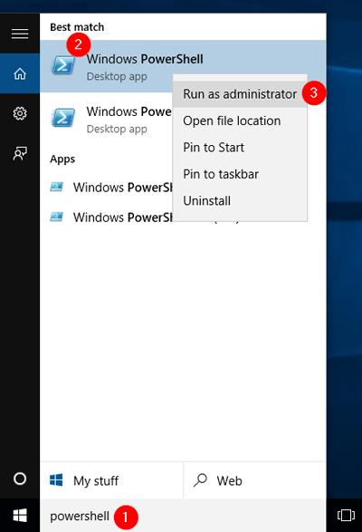

# How to set up a Unix/Linux environment on a Microsoft Windows computer

## Installation instructions for the Windows Subsystem for Linux (WSL)**

Link to the instructions by Microsoft: https://learn.microsoft.com/en-us/windows/wsl/install. 
Please check pre-requisites section to make sure your system is compatible and install accordingly.

## Steps
- Run windows powerShell in administrator mode.
    - In search bar type `powerShell`. Right click on the app and click on Run as Administrator from the drop-down menu.
    - 
- Type following in the terminal prompt
```
wsl --install
```

- Reboot your computer
- Once you reboot the ubuntu automatically starts launching itself. 
- Follow the instructions on the window. 
    - After a 15 minutes if nothing is shown press enter.
- It will ask Enter new UNIX username:
- Add  a username (and note it down somewhere)
- Then it asks New password:
- Enter a password. You cannot see it. Just type and enter. Then retype when asked. Note this down too.
- **NOTE AND REMEMBER YOUR PASSWORD!!!**
- Close launcher.

## Open Ubuntu
- Search ubuntu on search bar. CLick on the logo and open.
- Click on the black bar on top of th window and go to properties. Check the box saying use `Ctrl+C+V` as copy/paste. (Last option in the Edit options).

# Link your windows folder to Unix home folder

Sometimes you want to use files generated on your Linux system in windows (e.g., 
for plotting or further analysis in R studio), or you want to use files from your
windows filesystem (e.g., data downloaded from the internet) on your linux installation.

This is not totally straightforward, because installing the WSL means that you have installed a unix filesystem that is totally separate from 
your Windows file system. There is no direct way to access the Linux file system
and files on it from Windows. However, you can access the Windows file system from 
Linux. This means that from within Linux, you can copy files back and forth between Windows and
Linux directories using the commands `cp` or `rsync`.

To simplify this we suggest you to create a symbolic link (= shortcut) of frequently 
used windows folders in your linux home folder.

Link your Windows folder to Unix foler using following instructions.
- Find the path of your windows directory of choice.
	- Find a directory in windows where you want to have the data that you can access from your regular windows while using Linux/ Ubuntu.
	- Right click on the folder.
	- Go to properties and look at the path of this foler. You will find it at `Location:`. `Eg. C:\Users\sahaj\OneDrive\Documents\UA`
- Link this directory of choice to the Linux home folder.
	- Open your Ubuntu. (Close and open again if already open). You should be in your home folder. Type th following to check your home folder.
	```
	pwd
	```
	- You should see something like `/home/<your_username>`. Example: Mine looks like `/home/jaysmita/`.
	- If it is not like above then just type `cd` and press enter. This brings you back to your hom folder.
	```
	cd
	```
- Once you are in your home folder and know path to the directory of your choice. Type the following command.
	- The command looks like `ln -s </mnt/ path to your windows choice of directory> <A name for the link>`
	```
	ln -s /mnt/c/Users/sahaj/OneDrive/Documents/UA Windows 
	```
	- Make sure that after /mnt/ you use the correct path. 
	- Eg. if your windows location showed C:\Users\sahaj\OneDrive\Documents\UA use `/mnt/c/Users/sahaj/OneDrive/Documents/UA`.
	- If it says something like D:/data/project use `/mnt/d/data/project`
- This will create your link. When properly created if you type `ls` in your home folder you should be able to see the link name, which is `Windows` in this case will show in cyan blue colour.
- NOTE: Remember to always go into the link when opening Ubuntu every time. `cd` into your link name.
	- Open Ubuntu
	- `cd Windows`